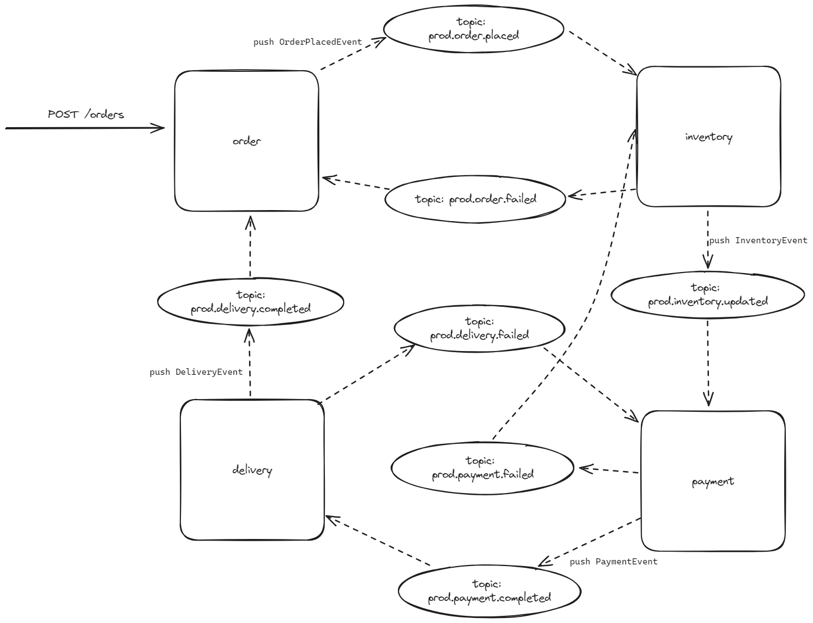

# Choreography Saga Pattern

## Overall Architecture 

### There are 4 microservices :
- Order Microservice
- Inventory Microservice
- Payment Microservice
- Delivery Microservice

### Techologies used
- Java 17
- Spring Boot 3.2.3
- Kafka
- Mysql
- Kafka UI for examining brokers, topics, partitions and messages
- Maven
